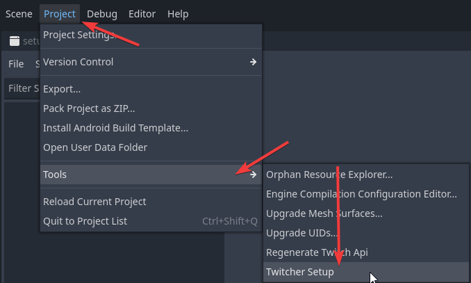

# Authentication

Twitcher uses OAuth 2.0 to securely authenticate with Twitch APIs. You'll need credentials from a registered Twitch application.

## Registering a Twitch Application

1.  Go to the [Twitch Developer Console](https://dev.twitch.tv/console).
2.  Click on "Register Your Application".
3.  Fill in the required details:
    *   **Name:** Choose a name for your application (e.g., "My Godot Game Integration").
    *   **OAuth Redirect URLs:** This is crucial. Use `http://localhost:7170` or a specific port Godot will listen. Take care that you do `http` not `https` on localhost! 
    *   **Category:** Select an appropriate category (e.g., "Game Integration").
4.  Click "Create".
5.  Note down your **Client ID**. You might also need the **Client Secret** depending on the OAuth flow used by the plugin. Save these and don't share with `ANYONE`. 

## Configuring Twitcher

For easier setup use the provided setup screen. When you accidentally closed it you can reopen it via: 